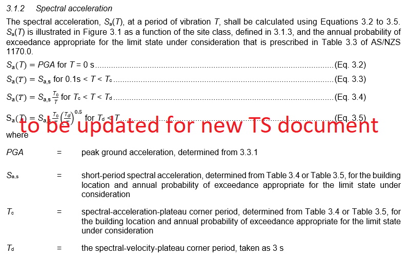
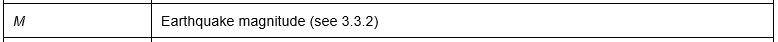
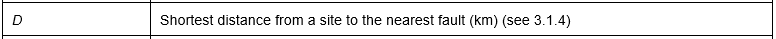
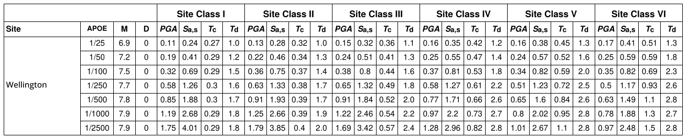
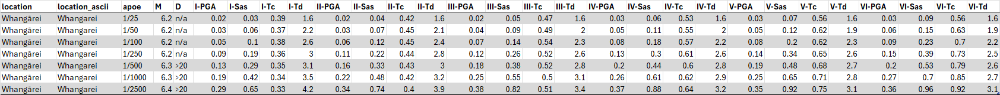
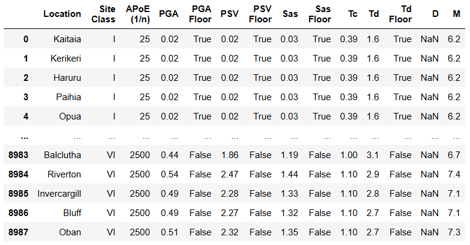
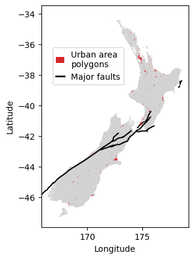

# TS 1170.5 Seismic Demand Parameters

 

## Digital supplements for Tables 3.4, 3.5, and 3.2 

This webpage provides access to the digital supplements associated with the Seismic Demand Parameter (SDP) tables provided in TS 1170.5 ([insert link]()). 

The parameter values vary by location, annual probability of exceedance (APOE), and Site Class.

 

The spectral shape-related parameters are defined in Section 3.1.2, copied below. 

Additional parameters include:

 

The TS 1170.5 provides two sets of SDP tables, one table for named urban and rural settlements (Table 3.4) and another table for a 0.1 x 0.1 degree grid of latitudes and longitudes (Table 3.5). The tables are provided in three file formats (PDF, JSON, and CSV), along with geospatial data files used in deriving the parameter values.

 

The relevant metadata for each format and links to the files are provided below. The following tools provide additional support for accessing the data:

- a python package (provided by GNS Science) for dynamically querying the parameter tables ([insert link]())
- a webtool (provided by SESOC) for visualising and downloading parameters on a location-by-location basis ([insert link]())

  

 

## File format metadata

 

### SDP tables 

The difference between Tables 3.4 and 3.5 is the type of location specified in the location groupings (where each location group includes six APOEs).

Table | Location type | Example
:--:|:---:| ---
**3.4** | &nbsp; named settlement | _Wellington_ 
**3.5** | lat/lon grid point | _-42.3~174.8_ (with 0.1 degree precision) 

 

#### PDF files

Formatted, searchable files, as included in the TS 1170.5 document. Settlement names with macrons are supplemented with a plain text version, for flexible searchability.

 

#### CSV files

Unformatted, comma separated text files.

 

#### JSON files

Python dictionaries including the SDP values and a schema defining the metadata. The dictionary can be read as a pandas table using:

        pandas.read_json(filepath, orient="table", precise_float=True)

Note that the format of the JSON table is different from that of the PDF and the CSV, due to its intended use in python environments, rather than as a visual lookup table. The *Location*, *Site Class*, and *APoE (1/n)* columns identify the relevant set of parameters, while the values of those parameters are provided in the *PGA* through *M* columns. Python functions for dynamically querying the table are available at ([insert link]()). Note that the location names use plain text characters rather than macrons.

There are five parameter columns that are not included in the other formats, *PSV* and four parameters labeled *Floor*. These additional parameters were derived during the development of the formal parameters referenced TS Section 3.1.2. The *Tc* values are derived from the *Sa,s* and *PSV* (peak spectral velocity) values. The four *Floor* parameters indicate whether their corresponding parameter was affected by the lower bound hazard (e.g., if *PGA Floor* is True, the *PGA* value was increased from the local mean hazard to the lower bound hazard). While *Tc* does not have a corresponding *Floor* parameter, it is affected by those of *Sa,s* and *PSV*.

 

 

### Geospatial data

#### Urban area polygons

The urban area polygons define the geographical boundaries of the named settlements in Table 3.4. Any site that is located in one of these named polygons should be assigned the corresponding parameter values. Any site that is not located in a polygon should be assigned the values corresponding to the nearest grid point in Table 3.5. 

Python functions are available at ([insert link]()) for querying the SDP values from the appropriate table for any pair of latitudes and longitudes. The SESOC webtool ([insert link]()) incorporates these functions in a graphical user interface to identify the location on a map, as well as visualise and download the acceleration spectra produced by the SDP values. 

Alternatively, the datafile can be imported into any software that recognizes the GEOJSON file format, including Google Earth Pro (the free desktop version), to visually identify the relevant polygon or grid point from which to read the SDP values.

 

#### Major faults

The major faults file defines the geographical location of the faults included in TS Table 3.2. The *D* value is defined in TS 3.1.4 as the shortest distance from the site to a major fault. This distance can be measured based on the geographical locations or it can be assigned from the conservative values provided in Tables 3.4 and 3.5.

The python functions and the webtool mentioned above provide the measured *D* values. Alternatively, the distances can be estimated using other geospatial software, such as the visual point-and-click measurements in Google Earth Pro.

 

 

## Links to files

### Named settlements (Table 3.4)

The parameter values in Table 3.4 apply for all locations that fall within urban and rural settlement boundaries, as defined by the geospatial polygon data provided in the GEOJSON file.

- [insert .pdf link]()
- [insert .csv link]()
- [insert .json link]()
- [insert .geojson link]()

### Grid locations (Table 3.5)

The parameter values in Table 3.5 apply for all other locations, by taking the nearest 0.1 x 0.1 degree latitude/longitude grid point.

- [insert .pdf link]()
- [insert .csv link]()
- [insert .json link]()

### Major faults (Table 3.2)

The geospatial data that defines the major faults named in Table 3.2.

- [insert .geojson link]()
