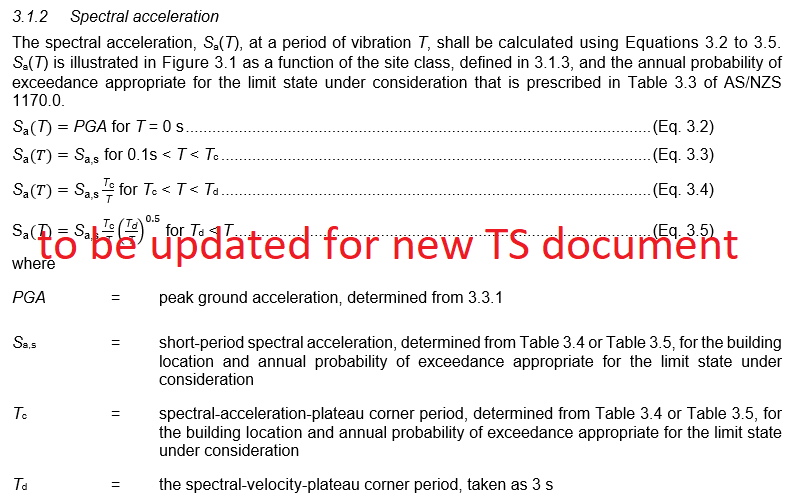
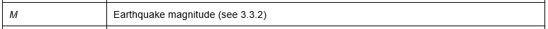
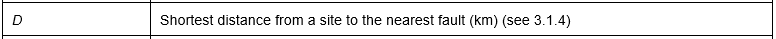
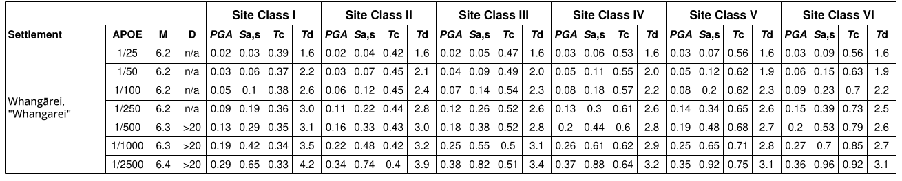
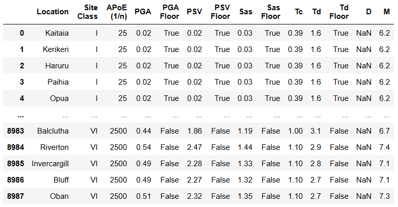
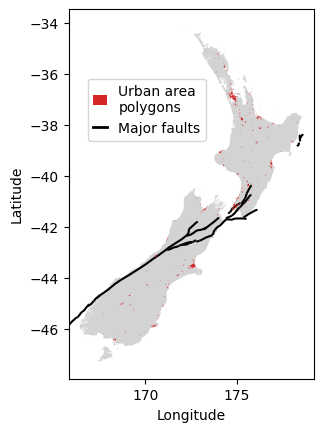

# TS 1170.5 Seismic Demand Parameters

*This library was used to generate the Seismic Demand Parameter (SDP) tables provided in TS 1170.5 ([insert link to SNZ publication]()).*

&nbsp;

The parameter values vary by location, annual probability of exceedance (APOE), and Site Class.
The four spectral acceleration-related parameters are defined in Section 3.1.2, copied below: 

Additional parameters include:

The TS 1170.5 provides two sets of SDP tables, one table for named urban and rural settlements (Table 3.1) and another table for a 0.1 x 0.1 degree grid of latitudes and longitudes (Table 3.2). 
The tables are provided in three file formats (.pdf, .json, and .csv), along with geospatial data files used in deriving the parameter values.

The relevant metadata for each format and links to the files are provided below. 
The [End User Tools](../end_user_functions/index.md) provide guidance on how to dynamically query the data.

&nbsp;

# File format metadata

## SDP tables 

The difference between Tables 3.1 and 3.2 is the type of location specified in the location groupings (where each location group includes six APOEs).

Table | Location type | Example
:--:|:---:| ---
**3.1** | &nbsp; named settlement | _Whangārei_ 
**3.2** | lat/lon grid point | _-42.3~174.8_ (with 0.1 degree precision) 

&nbsp;

### PDF files

Formatted, searchable files, as included in the TS 1170.5 document. Settlement names with macrons are supplemented with a plain text version, for flexible searchability.

&nbsp;

### CSV files

Unformatted, Comma Separated Value (CSV) text files with UTF-8 encoding.

#### Note for Microsoft Excel Users

Please [follow this guidance from Microsoft](https://support.microsoft.com/en-us/office/opening-csv-utf-8-files-correctly-in-excel-8a935af5-3416-4edd-ba7e-3dfd2bc4a032) to:

- help Excel import the UTF-8 encoding correctly for macrons in placenames, and

- override Excel's default date conversions, which affect APoE values such as 1/25.

&nbsp;

### JSON files

Python dictionaries including the SDP values and a schema defining the metadata. 
The dictionary can be read as a pandas table using:

        pandas.read_json(filepath, orient="table", precise_float=True)

Note that the format of the JSON table is different from that of the PDF and CSV tables, due to its intended use in python environments, rather than as a visual lookup table. 
The *Location*, *Site Class*, and *APoE (1/n)* columns identify the relevant set of parameters, while the values of those parameters are provided in the columns. 
Python functions for dynamically querying the table are provided as [End User Tools](../end_user_functions/index.md). 
Note that the location names use plain text characters rather than macrons.

There are five parameter columns that are not included in the other formats, *PSV* and four parameters labeled *Floor*. 
These additional parameters were derived during the development of the formal parameters referenced TS Section 3.1.2. 
The *Tc* values are derived from the *Sa,s* and *PSV* (peak spectral velocity) values. 
The four *Floor* parameters indicate whether their corresponding parameter was affected by the lower bound hazard (e.g., if *PGA Floor* is True, the *PGA* value was increased from the local mean hazard to the lower bound hazard). 
While *Tc* does not have a corresponding *Floor* parameter, it is affected by those of *Sa,s* and *PSV*.

&nbsp;

## Geospatial data

&nbsp;

### Urban area polygons

The urban area polygons define the geographical boundaries of the named settlements in Table 3.1. 
Any site that is located in one of these named polygons should be assigned the corresponding parameter values. 
Any site that is not located in a polygon should be assigned the values corresponding to the nearest grid point in Table 3.2. 

[End User Tools](../end_user_functions/index.md) are available for querying the SDP values from the appropriate table for any pair of latitudes and longitudes. 
Alternatively, the datafile can be imported into any software that recognizes the GEOJSON file format, including Google Earth Pro (the free desktop version), to visually identify the relevant polygon or grid point from which to read the SDP values.

&nbsp;

### Major faults

The major faults file defines the geographical location of the faults included in TS Table 3.2. 
The *D* value is defined in TS 3.1.4 as the shortest distance from the site to a major fault. 
This distance can be measured based on the geographical locations ([End User Tools](../end_user_functions/index.md)) or it can be assigned from the conservative values provided in Tables 3.1 and 3.2.

 *this option to calculate the distance may change--need input from the TS committee.* 

&nbsp;

# Links to files

## Named settlements (Table 3.1)

The parameter values in Table 3.1 apply for all locations that fall within urban and rural settlement boundaries, as defined by the geospatial polygon data provided in the GEOJSON file.

- [PDF file](https://github.com/GNS-Science/TS1170.5-SDP/blob/main/reports/v2/named_location_report.pdf)
- [CSV file](https://github.com/GNS-Science/TS1170.5-SDP/blob/main/reports/v2/named_location_report.csv)
- [JSON file](https://github.com/GNS-Science/TS1170.5-SDP/blob/main/resources/v2/named_locations_combo.json)
- [GEOJSON file](https://github.com/GNS-Science/TS1170.5-SDP/blob/main/resources/v2/urban_area_polygons.geojson)

## Grid locations (Table 3.2)

The parameter values in Table 3.2 apply for all other locations, by taking the nearest 0.1 x 0.1 degree latitude/longitude grid point.

- [PDF file](https://github.com/GNS-Science/TS1170.5-SDP/blob/main/reports/v2/gridded_location_report.pdf)
- [CSV file](https://github.com/GNS-Science/TS1170.5-SDP/blob/main/reports/v2/gridded_location_report.csv)
- [JSON file](https://github.com/GNS-Science/TS1170.5-SDP/blob/main/resources/v2/grid_locations_combo.json)

## Major faults (Table 3.XX)  *confirm table number with SNZ* 

The geospatial data that defines the major faults named in Table 3.XX.

- [GEOJSON file](https://github.com/GNS-Science/TS1170.5-SDP/blob/main/resources/v2/major_faults.geojson)

&nbsp;
