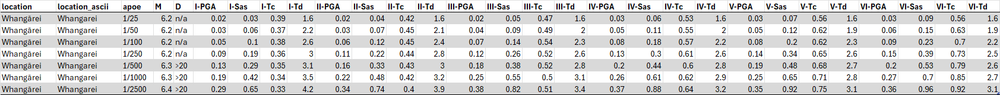

# TS 1170.5 Seismic Demand Parameters

*This page provides documentation of the content files associated with TS 1170.5, as published in 2025.
These contents are available in the **[deliverables/v2](https://github.com/GNS-Science/nzssdt-2023/tree/main/deliverables/v2)** folder.*

The TS 1170.5 SDP values vary by location, annual probability of exceedance (APOE), and site class.
The parameters include:

- ***M***, earthquake magnitude  
- ***D***, shortest distance from a site to the nearest fault (km)
- ***PGA***, peak ground acceleration (g)
- ***Sa,s***, short-period spectral acceleration (g)
- ***Tc***, spectral-acceleration-plateau corner period (s)
- ***Td***, spectral-velocity-plateau corner period (s)

The TS 1170.5 provides two sets of SDP tables, one table for named urban and rural settlements (Table 3.1) and another table for a 0.1 x 0.1 degree grid of latitudes and longitudes (Table 3.2). 
The tables are provided in three file formats (.pdf, .json, and .csv), along with the associated geospatial data in .geojson format.

The relevant metadata for each format and links to the files are provided below. 
The [end user tools](../end_user_functions/index.md) provide guidance on how to dynamically query the data.

&nbsp;

# File format metadata

## SDP tables 

The difference between Tables 3.1 and 3.2 is the type of location specified in the location groupings (where each location group includes six APOEs).

Table | Location type | Example
:--:|:---:| ---
**3.1** | &nbsp; named settlement | _Whangārei_ 
**3.2** | lat/lon grid point | _-42.3~174.8_ (with 0.1 degree precision) 

&nbsp;

### PDF files

Formatted, searchable files, as included in the TS 1170.5 document. Settlement names with macrons are supplemented with a plain text version, for flexible searchability.

&nbsp;

### CSV files

Unformatted, Comma Separated Value (CSV) text files with UTF-8 encoding.

&nbsp;

### JSON files

Python dictionaries including the SDP values and a schema defining the metadata. 
The dictionary can be read as a pandas table using:

        pandas.read_json(filepath, orient="table", precise_float=True)

Note that the format of the JSON table is different from that of the PDF and CSV tables, due to its intended use in python environments, rather than as a visual lookup table. 
The *Location*, *Site Class*, and *APoE (1/n)* columns identify the relevant set of parameters, while the values of those parameters are provided in the columns. 
Python functions for dynamically querying the table are provided as [end user tools](../end_user_functions/index.md). 
Note that the location names use plain text characters rather than macrons.

The JSON tables include five parameters that are not included in the other formats: *PSV* and four parameters labeled *Floor*. 
These additional parameters were used in developing the formal parameters referenced in TS 1170.5. 
The *Tc* values are derived from the *Sa,s* and *PSV* (peak spectral velocity) values. 
The four *Floor* parameters indicate whether their corresponding parameter was affected by the lower bound hazard
(e.g., if *PGA Floor* is True, then the *PGA* value was increased from the local mean hazard to the lower bound hazard). 
While *Tc* does not have a corresponding *Floor* parameter, it is affected by those of *Sa,s* and *PSV*.

&nbsp;

## Geospatial data

### Urban area polygons

The urban area polygons define the geographical boundaries of the named settlements in Table 3.1. 
Sites located within one of these named polygons should be assigned the corresponding parameter values. 
Sites that is not located in a polygon should be assigned the values corresponding to the nearest grid point in Table 3.2. 

[End user tools](../end_user_functions/index.md) are available for querying the SDP values from the appropriate table for any pair of latitudes and longitudes. 
Alternatively, the datafile can be imported into any software that recognizes the GEOJSON file format, including [https://geojson.tools](https://geojson.tools), to visually identify the relevant polygon or grid point.

### Grid points

A geographical representation of Table 3.2's grid of 0.1 x 0.1 degree latitudes and longitudes across New Zealand. 

### Major faults

The major faults file defines the geographical location of the faults included in TS Table 3.4. 
The *D* parameter is the shortest distance from a site to any of these major faults. 
While the TS 1170.5 only permits the use of the tabulated D values for each polygon and grid point, 
the [end user tools](../end_user_functions/index.md) can be used to calculate the distance to the site itself, for reference.

&nbsp;

# Links to files

## Named settlements (Table 3.1)

The parameter values in Table 3.1 apply for all locations that fall within urban and rural settlement boundaries, as defined by the geospatial polygon data provided in the GEOJSON file.

- [PDF file](https://github.com/GNS-Science/TS1170.5-SDP/blob/main/deliverables/v2/TS1170-5_Table3-1_2025.pdf)
- [CSV file](https://github.com/GNS-Science/TS1170.5-SDP/blob/main/deliverables/v2/TS1170-5_Table3-1_2025.csv)
- [JSON file](https://github.com/GNS-Science/TS1170.5-SDP/blob/main/deliverables/v2/TS1170-5_Table3-1_2025.json)
- [GEOJSON file](https://github.com/GNS-Science/TS1170.5-SDP/blob/main/deliverables/v2/TS1170-5_UrbanAreaPolygons_2025.geojson)

## Grid locations (Table 3.2)

The parameter values in Table 3.2 apply for all other locations, by taking the nearest 0.1 x 0.1 degree latitude/longitude grid point.

- [PDF file](https://github.com/GNS-Science/TS1170.5-SDP/blob/main/deliverables/v2/TS1170-5_Table3-2_2025.pdf)
- [CSV file](https://github.com/GNS-Science/TS1170.5-SDP/blob/main/deliverables/v2/TS1170-5_Table3-2_2025.csv)
- [JSON file](https://github.com/GNS-Science/TS1170.5-SDP/blob/main/deliverables/v2/TS1170-5_Table3-2_2025.json)
- [GEOJSON file](https://github.com/GNS-Science/TS1170.5-SDP/blob/main/deliverables/v2/TS1170-5_GridPoints_2025.geojson)

## Major faults (Table 3.4)

The geospatial data that defines the major faults named in Table 3.4.

- [GEOJSON file](https://github.com/GNS-Science/TS1170.5-SDP/blob/main/deliverables/v2/TS1170-5_MajorFaults_2025.geojson)

&nbsp;
